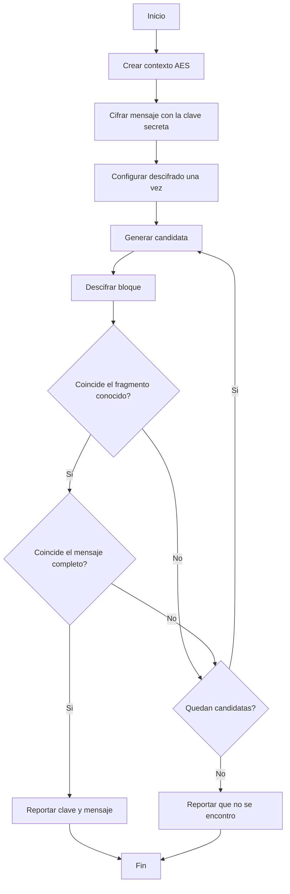

# Laboratorio 03: búsqueda de clave AES con Open MPI

**CC3069 Computación Paralela y Distribuida** · Universidad del Valle de Guatemala

**Integrantes:** Fernando Rueda, Felipe Aguilar, Fernando Hernández

## 1. Investigación sobre AES

### a) Campos de aplicación

AES (Advanced Encryption Standard) es un cifrado simétrico por bloques que el NIST adoptó como estándar en 2001. Está basado en el algoritmo Rijndael y reemplazó a DES porque la clave de 56 bits de DES ya se podía romper por fuerza bruta. Al ser simétrico, la misma clave sirve para cifrar y para descifrar. Algunos ejemplos actuales de uso son:

- **Comunicaciones web:** HTTPS con TLS 1.2 y 1.3 usa AES-GCM para cifrar el tráfico una vez que el navegador y el servidor acuerdan una clave.
- **Redes inalámbricas y VPN:** WPA2 y WPA3 cifran el tráfico Wi-Fi con AES (CCMP), y VPNs como IPsec u OpenVPN también lo usan.
- **Almacenamiento:** el cifrado de disco de BitLocker, FileVault y LUKS utiliza AES en modo XTS, igual que muchos celulares para proteger sus datos.
- **Mensajería:** WhatsApp y Signal cifran el contenido de los mensajes con AES dentro de su protocolo de extremo a extremo.

### b) Cifrado y descifrado con AES-128

En AES-128 la clave mide 128 bits (16 bytes) y el texto se procesa en bloques fijos de 128 bits. Cada bloque se acomoda en una matriz de 4×4 bytes que llamamos estado. Si el mensaje no es múltiplo de 16 bytes hay que rellenarlo (por ejemplo con PKCS#7), y si es más largo que un bloque se necesita un modo de operación como CBC, CTR o GCM que define cómo se encadenan los bloques.

Antes de cifrar, la expansión de clave genera 11 subclaves de 128 bits a partir de la clave original, una para la ronda inicial y una para cada una de las 10 rondas. El cifrado de un bloque sigue estos pasos:

1. **Ronda inicial:** AddRoundKey, que hace XOR del estado con la primera subclave.
2. **Rondas 1 a 9**, cada una con cuatro transformaciones:
   - **SubBytes:** cambia cada byte por otro usando la S-box, lo que da la parte no lineal del algoritmo.
   - **ShiftRows:** rota las filas del estado 0, 1, 2 y 3 posiciones a la izquierda.
   - **MixColumns:** mezcla los bytes de cada columna con una multiplicación en GF(2⁸), de modo que un byte afecta a toda la columna.
   - **AddRoundKey** con la subclave de esa ronda.
3. **Ronda final (10):** SubBytes, ShiftRows y AddRoundKey, sin MixColumns.

Para descifrar se aplican las transformaciones inversas (InvShiftRows, InvSubBytes, InvMixColumns y AddRoundKey) en orden contrario, usando las mismas subclaves pero empezando por la última. La clave interviene en ambos procesos solo a través de AddRoundKey, y como el XOR es su propia inversa, ese paso es igual al cifrar y al descifrar.

### c) Diagrama de flujo

## 2. Análisis del programa secuencial

El programa recibe un mensaje de 16 bytes y una clave candidata representada por un entero de 64 bits. `make_key` coloca ese entero en los ocho bytes menos significativos de una clave AES-128, mientras los bytes restantes quedan en cero. Primero se cifra el mensaje con `SECRET_KEY`; luego se prueban las candidatas en orden y se descifra el bloque con AES-128-ECB sin relleno.

La mejora 1 configura el algoritmo y el relleno una sola vez. En cada iteracion solo cambia la clave del contexto y procesa el bloque. La busqueda termina cuando el texto descifrado coincide con el fragmento conocido y despues con el mensaje completo. Esta segunda comprobacion conserva la exactitud y evita aceptar una coincidencia parcial.

## 3. Errores conceptuales y mejoras

### a) Errores conceptuales y limitaciones

<!-- Fernando Hernández -->

### b) Mejoras implementadas

Todas las mejoras están en `src/busqueda_clave_aes_mejorado.c`. El programa original lo dejamos sin cambios para poder comparar.

**Mejora 1, rendimiento (propuesta por Fernando Rueda).** En el original, `crypt_block` llama a `EVP_CipherInit_ex` con `EVP_aes_128_ecb()` y a `EVP_CIPHER_CTX_set_padding` en cada una de las candidatas, de modo que OpenSSL vuelve a buscar el algoritmo y a configurar el contexto más de un millón de veces aunque nunca cambien. Separamos esa parte en `setup_cipher`, que se llama una sola vez antes del ciclo, y dentro del ciclo solo cambiamos la clave con `EVP_CipherInit_ex(ctx, NULL, NULL, key, NULL, -1)`. Probando con la última clave del rango (1,048,575) para recorrerlo completo, el tiempo bajó de unos 0.19 s a 0.04 s, lo que significa que casi el 80 % del trabajo era reconfigurar el contexto y no descifrar. Esto también ayuda a la versión MPI, porque cada proceso hace menos trabajo por candidata.

**Mejora 2, validación por fragmento conocido (Felipe Aguilar).** Cada candidata descifrada se compara primero contra el prefijo `"Puedes"`, de seis bytes. La mayoría de candidatas se descarta con esta comparación corta y solo una coincidencia continúa hacia la comparación de los 16 bytes completos. Así se reduce el trabajo de validación sin sacrificar la corrección del resultado. La misma regla se utiliza en la versión MPI.

## 4. Versión paralela con Open MPI

### a) Diseño de la versión paralela

La versión MPI divide el rango total de candidatas en bloques contiguos. Si el rango no es divisible entre los procesos, los primeros procesos reciben una candidata adicional. Cada proceso crea su propio contexto AES, cifra localmente el mensaje de referencia y descifra únicamente su bloque.

La terminación se coordina por rondas con `MPI_Allreduce`. En cada ronda, cada proceso aporta la menor clave encontrada o `UINT64_MAX` si no encontró ninguna. `MPI_MIN` produce una única clave global; si todos terminan su bloque sin encontrarla, `MPI_LOR` determina que ya no quedan procesos activos. Los procesos sin candidatas siguen participando en las colectivas, por lo que no se producen bloqueos. Finalmente, el proceso 0 imprime una sola vez la clave, el mensaje, el número de procesos y el tiempo.

### b) Tiempos y speedup

<!-- Fernando Hernández -->

| Cantidad de procesos (n) | Tiempo (s) | Speedup calculado |
|---|---|---|
| 1 (secuencial) | | 1.00 |
| 2 | | |
| 3 | | |
| 4 | | |

## Evidencia

Las capturas de cada integrante están en `evidencia/`.
