# Laboratorio 03: búsqueda de clave AES con Open MPI

**CC3069 Computación Paralela y Distribuida** · Universidad del Valle de Guatemala

**Integrantes:** Fernando Rueda, Felipe Aguilar, Fernando Hernández

**Repositorio:** https://github.com/FelipeAP04/Lab3-Paralelas

## 1. Investigación sobre AES

### a) Campos de aplicación

AES (Advanced Encryption Standard) es un cifrado simétrico por bloques que el NIST adoptó como estándar en 2001. Está basado en el algoritmo Rijndael y reemplazó a DES porque la clave de 56 bits de DES ya se podía romper por fuerza bruta. Al ser simétrico, la misma clave sirve para cifrar y para descifrar. Algunos ejemplos actuales de uso son:

- **Comunicaciones web:** HTTPS con TLS 1.2 y 1.3 usa AES-GCM para cifrar el tráfico una vez que el navegador y el servidor acuerdan una clave.
- **Redes inalámbricas y VPN:** WPA2 y WPA3 cifran el tráfico Wi-Fi con AES (CCMP), y VPNs como IPsec u OpenVPN también lo usan.
- **Almacenamiento:** el cifrado de disco de BitLocker, FileVault y LUKS utiliza AES en modo XTS, igual que muchos celulares para proteger sus datos.
- **Mensajería:** WhatsApp y Signal cifran el contenido de los mensajes con AES dentro de su protocolo de extremo a extremo.

### b) Cifrado y descifrado con AES-128

En AES-128 la clave mide 128 bits (16 bytes) y el texto se procesa en bloques fijos de 128 bits. Cada bloque se acomoda en una matriz de 4×4 bytes que llamamos estado. Si el mensaje no es múltiplo de 16 bytes hay que rellenarlo (por ejemplo con PKCS#7), y si es más largo que un bloque se necesita un modo de operación como CBC, CTR o GCM que define cómo se encadenan los bloques.

Antes de cifrar, la expansión de clave genera 11 subclaves de 128 bits a partir de la clave original, una para la ronda inicial y una para cada una de las 10 rondas. El cifrado de un bloque sigue estos pasos:

1. **Ronda inicial:** AddRoundKey, que hace XOR del estado con la primera subclave.
2. **Rondas 1 a 9**, cada una con cuatro transformaciones:
   - **SubBytes:** cambia cada byte por otro usando la S-box, lo que da la parte no lineal del algoritmo.
   - **ShiftRows:** rota las filas del estado 0, 1, 2 y 3 posiciones a la izquierda.
   - **MixColumns:** mezcla los bytes de cada columna con una multiplicación en GF(2⁸), de modo que un byte afecta a toda la columna.
   - **AddRoundKey** con la subclave de esa ronda.
3. **Ronda final (10):** SubBytes, ShiftRows y AddRoundKey, sin MixColumns.

Para descifrar se aplican las transformaciones inversas (InvShiftRows, InvSubBytes, InvMixColumns y AddRoundKey) en orden contrario, usando las mismas subclaves pero empezando por la última. La clave interviene en ambos procesos solo a través de AddRoundKey, y como el XOR es su propia inversa, ese paso es igual al cifrar y al descifrar.

### c) Diagrama de flujo

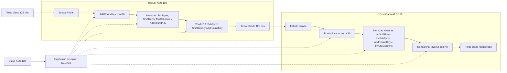

## 2. Análisis del programa secuencial

El programa original sí utiliza la implementación AES-128 de OpenSSL mediante `EVP_aes_128_ecb()`. AES-128 requiere una clave de 16 bytes y procesa bloques de 16 bytes; el programa cumple con el tamaño del bloque porque `MESSAGE_LEN` vale 16 y desactiva el relleno con `EVP_CIPHER_CTX_set_padding(ctx, 0)`. Por ello, el mensaje `"Puedes lograrlo!"` se cifra y se descifra como un único bloque completo.

La función `make_key` construye esos 16 bytes colocando la candidata de 64 bits en los ocho bytes menos significativos y dejando los ocho bytes restantes en cero. Después, `crypt_block` usa la clave construida para cifrar el mensaje con `SECRET_KEY`. Durante la búsqueda, el programa prueba candidatas desde cero, descifra el bloque cifrado con `encrypt = 0` y compara los 16 bytes obtenidos con el mensaje original. La misma clave sirve para cifrar y descifrar, pero OpenSSL aplica internamente las transformaciones inversas correspondientes.

La implementación es correcta para el ejercicio, aunque no representa un uso seguro de AES en producción. El modo ECB no usa IV y revela patrones cuando se cifran varios bloques; además, no hay autenticación ni protección contra modificaciones. El espacio explorado tampoco es el de una clave AES-128 real: solo se prueban `2^20` candidatas y la función fija ocho bytes en cero, por lo que la fuerza bruta es viable únicamente por esta reducción artificial del espacio de búsqueda.

## 3. Errores conceptuales y mejoras

### a) Errores conceptuales y limitaciones

- **La clave no es realmente de 128 bits.** `make_key` copia el entero en los ocho bytes menos significativos y deja los otros ocho en cero. Como además la búsqueda se limita a 2²⁰ candidatas, la clave tiene en la práctica 20 bits de entropía. La fuerza bruta funciona solo por eso: con una clave AES-128 aleatoria habría 2¹²⁸ posibilidades y recorrerlas sería inviable con cualquier cantidad de procesos. El programa no demuestra que AES sea débil, sino que una clave mal generada sí lo es.
- **El programa que busca ya conoce la clave.** El mismo proceso cifra el mensaje con `SECRET_KEY` y después lo "ataca". En un escenario real el atacante solo tendría el texto cifrado. Para el ejercicio está bien, pero la clave secreta y la búsqueda deberían estar separadas.
- **Se supone que se conoce el mensaje completo.** La búsqueda compara los 16 bytes descifrados con el texto original. Si ya se conociera el mensaje no haría falta romper el cifrado. Lo realista es conocer solo una parte o un formato (una cabecera, un prefijo), que es lo que hace la mejora 2 al validar primero un fragmento.
- **ECB y un único bloque.** El mensaje debe medir exactamente 16 bytes y se cifra en modo ECB sin relleno ni IV. En ECB dos bloques iguales producen el mismo texto cifrado, por lo que no sirve para mensajes reales; lo correcto sería CBC, CTR o GCM, con relleno cuando haga falta.
- **Trabajo repetido en cada candidata.** `crypt_block` vuelve a inicializar el algoritmo y el relleno con cada clave, aunque nunca cambian. Es la causa del costo que elimina la mejora 1.
- **Parámetros fijos en el código.** La clave, el rango y el mensaje son constantes, así que para probar otro caso hay que recompilar. Eso lo resuelve la mejora 3.
- **El tiempo medido depende de dónde está la clave.** Con la clave 12345 la búsqueda termina tras probar el 1.2 % del rango, en milisegundos. Ese tiempo no representa el costo de la búsqueda y tampoco sirve para comparar con la versión paralela: con reparto por bloques, la clave 12345 siempre cae en el bloque del proceso 0, que la encuentra igual de rápido que el secuencial. Para medir el speedup hay que fijar el peor caso, con la clave al final del rango.

### b) Mejoras implementadas

Todas las mejoras están en `src/busqueda_clave_aes_mejorado.c`. El programa original lo dejamos sin cambios para poder comparar.

**Mejora 1, rendimiento (propuesta por Fernando Rueda).** En el original, `crypt_block` llama a `EVP_CipherInit_ex` con `EVP_aes_128_ecb()` y a `EVP_CIPHER_CTX_set_padding` en cada una de las candidatas, de modo que OpenSSL vuelve a buscar el algoritmo y a configurar el contexto más de un millón de veces aunque nunca cambien. Separamos esa parte en `setup_cipher`, que se llama una sola vez antes del ciclo, y dentro del ciclo solo cambiamos la clave con `EVP_CipherInit_ex(ctx, NULL, NULL, key, NULL, -1)`. Probando con la última clave del rango (1,048,575) para recorrerlo completo, el tiempo bajó de unos 0.19 s a 0.04 s, lo que significa que casi el 80 % del trabajo era reconfigurar el contexto y no descifrar. Esto también ayuda a la versión MPI, porque cada proceso hace menos trabajo por candidata.

**Mejora 2, validación por fragmento conocido (Felipe Aguilar).** Cada candidata descifrada se compara primero contra el prefijo `"Puedes"`, de seis bytes. La mayoría de candidatas se descarta con esta comparación corta y solo una coincidencia continúa hacia la comparación de los 16 bytes completos. Así se reduce el trabajo de validación sin sacrificar la corrección del resultado. La misma regla se utiliza en la versión MPI.

**Mejora 3, parámetros por línea de comandos (Fernando Hernández).** El mejorado y la versión MPI reciben la clave secreta (`-k`), el rango de candidatas (`-n`) y el mensaje (`-m`). Si no se indican, usan los valores del original. El mensaje puede medir de 1 a 16 bytes: si es más corto se completa con espacios hasta llenar el bloque, y el fragmento conocido pasa a ser sus primeros seis bytes (o todos, si tiene menos). Se rechazan los valores inválidos, como una clave fuera del rango, un rango de cero o un mensaje de más de 16 bytes. En MPI todos los procesos leen los mismos argumentos y solo el proceso 0 muestra el mensaje de uso. Gracias a esta mejora podemos medir el peor caso sin recompilar, y `scripts/verificar.sh` comprueba con cualquier combinación de parámetros que todas las versiones recuperen la misma clave y el mismo mensaje.

## 4. Versión paralela con Open MPI

### a) Diseño de la versión paralela

La versión MPI divide el rango total de candidatas en bloques contiguos. Si el rango no es divisible entre los procesos, los primeros procesos reciben una candidata adicional. Cada proceso crea su propio contexto AES, cifra localmente el mensaje de referencia y descifra únicamente su bloque.

La terminación se coordina por rondas con `MPI_Allreduce`. En cada ronda, cada proceso prueba hasta 4,096 candidatas de su bloque y aporta dos valores: la clave encontrada o `UINT64_MAX` si no encontró ninguna, y un 1 si ya terminó su bloque. Una sola reducción con `MPI_MIN` produce la clave global y, en la segunda posición, vale 1 solo cuando todos los procesos terminaron sin encontrarla. Los procesos sin candidatas siguen participando en las colectivas, por lo que no se producen bloqueos. Finalmente, el proceso 0 imprime una sola vez la clave, el mensaje, el número de procesos y el tiempo.

### b) Tiempos y speedup

Medimos el peor caso: un rango de 2²⁴ candidatas (16,777,216) con la clave 16,777,215 al final. Así el último proceso tiene que recorrer su bloque completo y todos trabajan durante toda la búsqueda. Usamos el rango de 2²⁴ en lugar de 2²⁰ porque con 2²⁰ el mejorado tarda unos 0.04 s y el tiempo de arranque de MPI pesaría más que la búsqueda. Como línea base tomamos el mejorado secuencial, que aplica las mismas mejoras 1 y 2 que la versión MPI; así el speedup mide solo el efecto de paralelizar. En la versión MPI el tiempo se toma con `MPI_Wtime` después de una barrera, y el proceso 0 reporta el del proceso más lento (`MPI_Reduce` con `MPI_MAX`). Cada valor es el promedio de 5 corridas de `REPETICIONES=5 scripts/verificar.sh 16777215 16777216` en un Apple M4 Pro.

| Cantidad de procesos (n) | Tiempo (s) | Speedup calculado |
|---|---|---|
| 1 (secuencial) | 0.668 | 1.00 |
| 2 | 0.352 | 1.89 |
| 3 | 0.254 | 2.62 |
| 4 | 0.190 | 3.51 |

El speedup es cercano al lineal (eficiencia del 88 % con 4 procesos) porque las candidatas son independientes y el reparto por bloques es equilibrado. La diferencia con el ideal viene del arranque de cada proceso y de las sincronizaciones periódicas.

Llegar a estos números requirió cambiar la frecuencia de sincronización. La primera versión hacía dos `MPI_Allreduce` por candidata, y con el mismo caso tardaba 2.40 s con 2 procesos y 3.24 s con 4: era más lenta que el secuencial y empeoraba al agregar procesos, porque una colectiva cuesta mucho más que descifrar un bloque. Ahora cada proceso prueba 4,096 candidatas entre sincronizaciones y combina la clave encontrada y el aviso de que terminó en una sola `MPI_Allreduce` con `MPI_MIN`. A cambio, un proceso puede seguir trabajando hasta 4,095 candidatas después de que otro encontró la clave, lo que equivale a menos de un milisegundo.

## Evidencia

Cada integrante compiló y ejecutó en su máquina el secuencial original, el mejorado y la versión MPI con 2, 3 y 4 procesos. Fernando Rueda y Fernando Hernández corrieron además la verificación del peor caso con `scripts/verificar.sh`. En todas las corridas se recuperó la clave `12345` con el mensaje `Puedes lograrlo!`, y en el peor caso la clave `16777215`.

### Fernando Rueda

**1. Compilación y secuencial original**

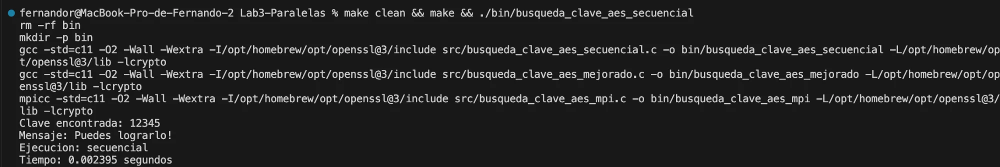

**2. Secuencial mejorado**

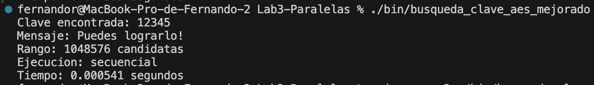

**3. MPI con 2 procesos**

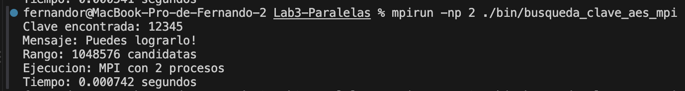

**4. MPI con 3 procesos**

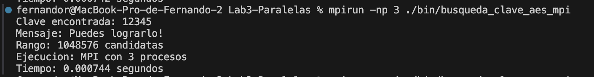

**5. MPI con 4 procesos**

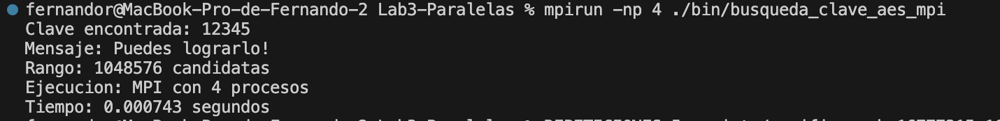

**6. Verificación y speedup en el peor caso (clave 16,777,215, rango 2²⁴)**

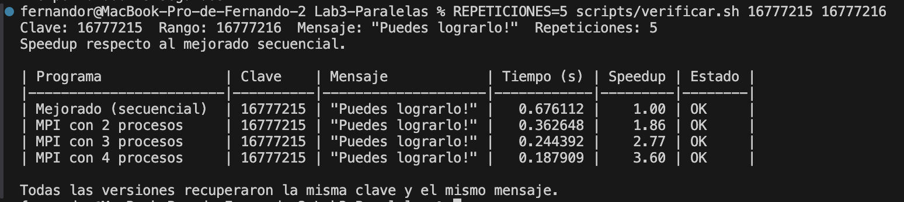

### Felipe Aguilar

La compilación se realizó con:

```bash
make clean && make
```

El comando terminó correctamente y compiló los tres programas sin warnings. Las corridas están registradas en [evidencia/felipe_aguilar/corridas.md](evidencia/felipe_aguilar/corridas.md), y la captura muestra los comandos y resultados del secuencial original, el mejorado y MPI con 2, 3 y 4 procesos.

**Captura de corridas**

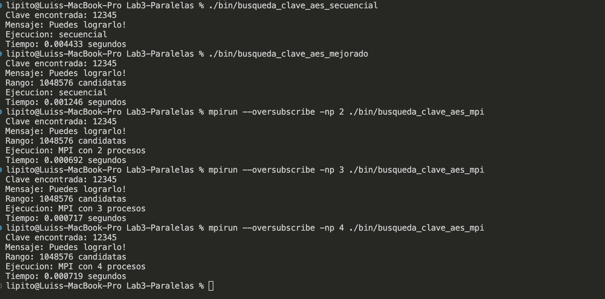

### Fernando Hernández

**1. Compilación y secuencial original**

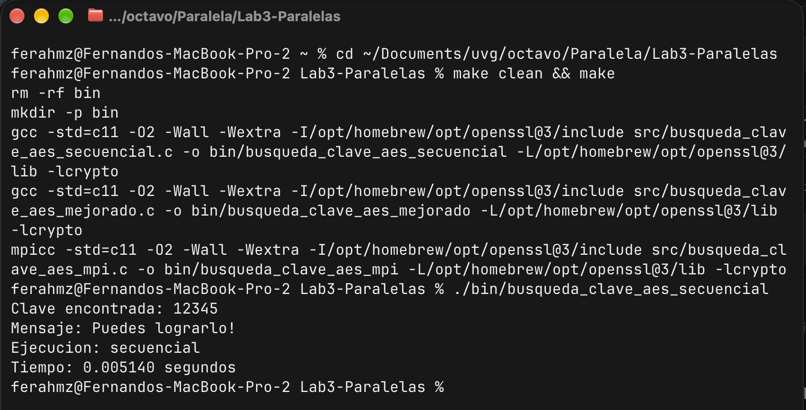

**2. Secuencial mejorado**

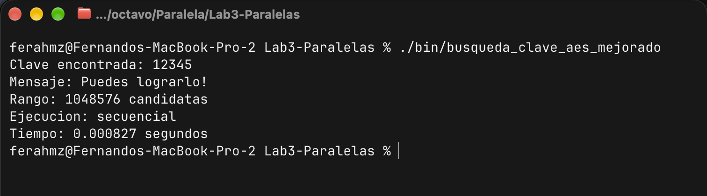

**3. MPI con 2 procesos**


**4. MPI con 3 procesos**

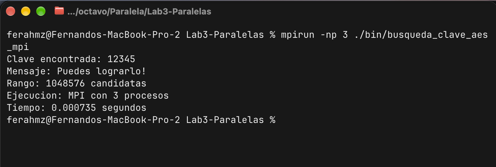

**5. MPI con 4 procesos**

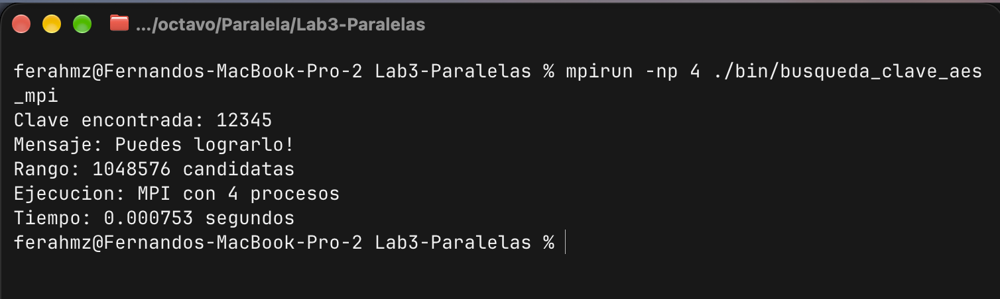

**6. Verificación y speedup en el peor caso (clave 16,777,215, rango 2²⁴)**

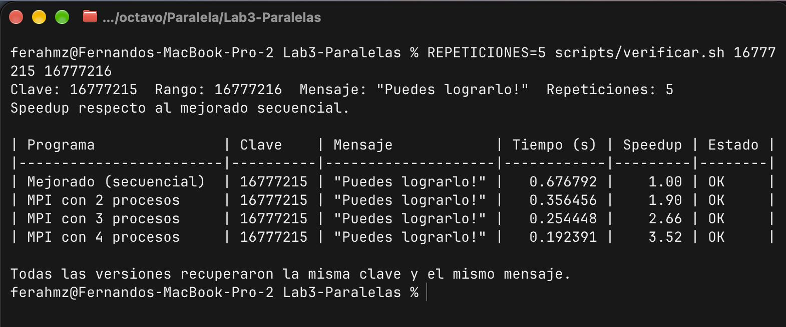
